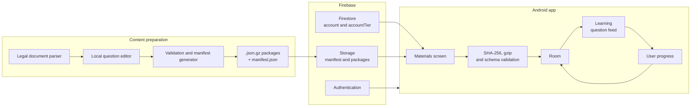
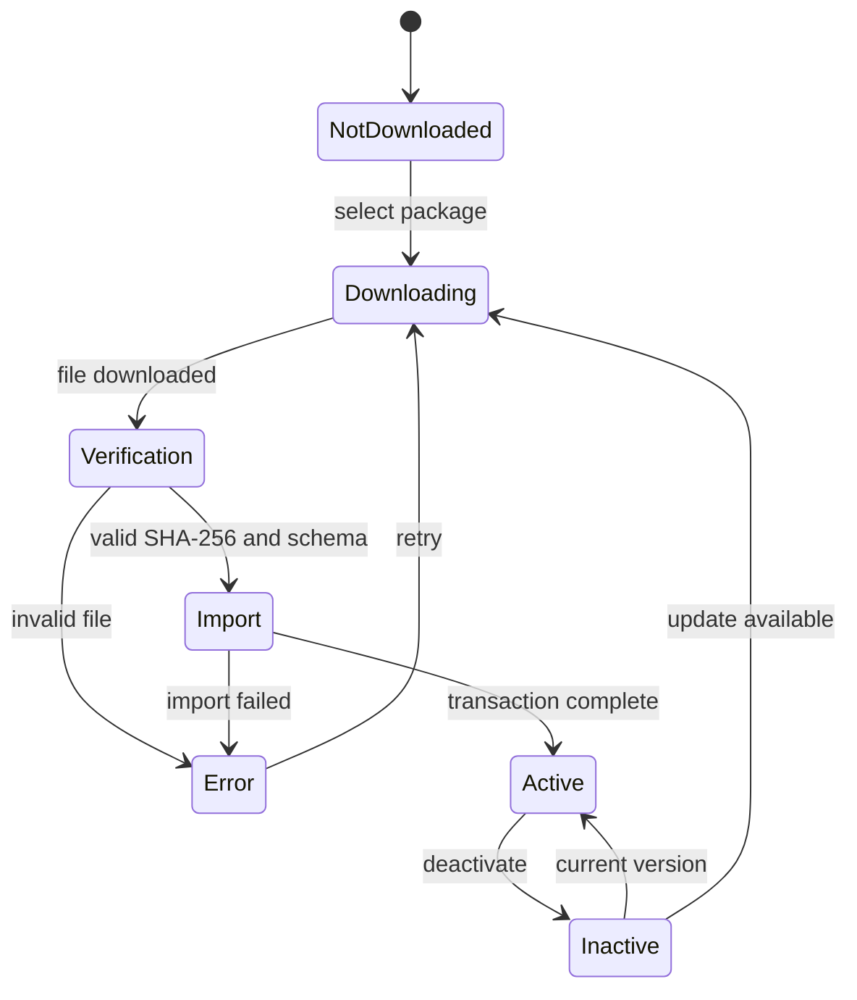
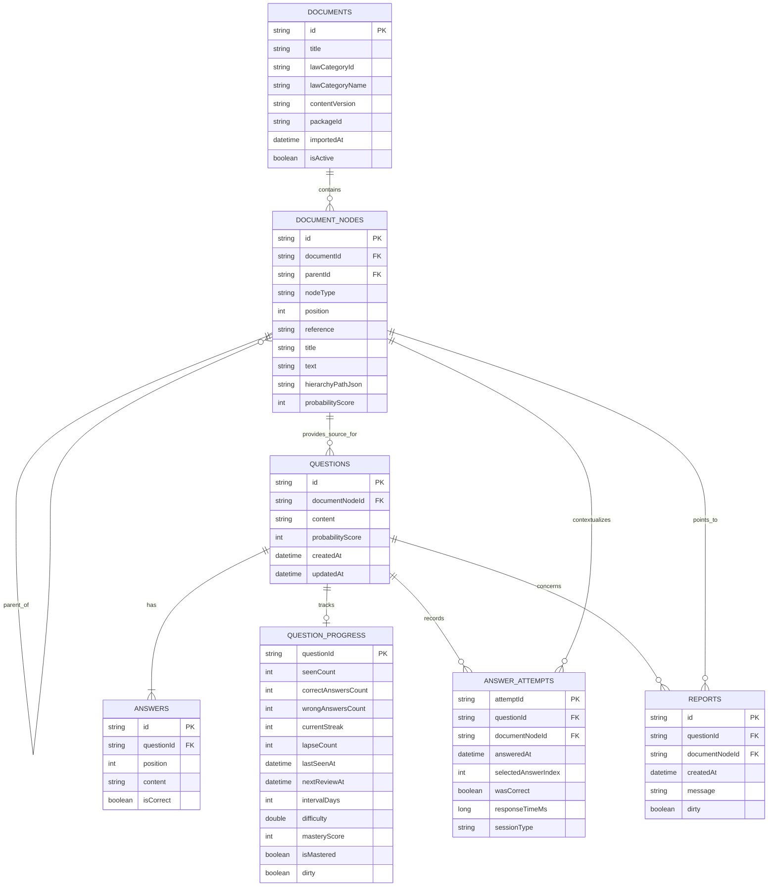

# APPlikacja

> An offline-first Android app for learning law through short, interactive multiple-choice questions.

APPlikacja helps users prepare for multiple-choice law exams. It combines a
vertically scrolling, short-form feed with direct access to the relevant legal
provisions, offline learning, and versioned question packages downloaded on
demand.

The project is a native Android application built with Kotlin and Jetpack
Compose. Its source code remains in a private repository; this repository
showcases the working product, its architecture, and the key technical
decisions behind it.

## Demo

https://github.com/user-attachments/assets/64bc63f2-9cd4-489d-8df0-82203c616714

The recording shows the complete core flow in the Polish-language interface:
signing in, downloading and activating legal study materials, answering
questions, checking correct and incorrect answers, opening the full source
provision with a horizontal swipe, moving between questions, managing locally
stored packages, switching between light and dark themes, and signing out.

## Key features

- Email and Google sign-in with Firebase Authentication
- A materials catalog loaded dynamically from Firebase Storage
- On-demand downloads of selected, versioned `.json.gz` question packages
- Package integrity checks based on file size and SHA-256
- Background decompression, validation, and transactional imports
- A local Room database for learning without an internet connection
- A vertical question feed built with `VerticalPager`
- A horizontal gesture for switching between a question and its legal source
- Local answer history and individual learning progress
- Activation and deactivation of downloaded materials without downloading them again
- Automatic updates for active packages
- Light and dark Material 3 themes
- Basic accessibility support, including TalkBack actions

## How it works

1. After sign-in, the app downloads a small `manifest.json` describing the
   available legal fields, package versions, and file locations.
2. The user selects the materials they want to keep on the device.
3. The app downloads a compressed package to a temporary file and verifies its
   SHA-256 checksum.
4. Decompression, validation, and import into Room run on `Dispatchers.IO`, so
   the interface remains responsive.
5. The Learn screen draws questions exclusively from active packages stored
   locally.

## Interface shown in the demo

The app uses a three-tab bottom navigation bar for **Learn**, **Materials**, and
**Settings**. The recording opens in a dark theme with warm cream accents and
green status highlights, then demonstrates the light theme and returns to the
dark theme.

Each question fills one vertically scrollable card. The card displays the legal
reference, the question, three answer options, a report action, and a short
gesture hint. Selecting an answer provides immediate feedback: the correct
option is highlighted in green and an incorrect selection in red. Swiping right
opens the full text of the cited provision; swiping left returns to the question,
and swiping up advances to the next card.

The Materials screen groups downloadable packages by area of law. Package cards
show their version, question count, file size, and current state, including
downloading, installing, active, and stored locally. A confirmation dialog is
shown before a material is deactivated. The Settings screen contains account
controls and system, light, and dark theme options.

## Architecture

The application follows an offline-first approach. Firebase is not queried for
every question separately: the backend distributes versioned packages, while
the learning experience runs on local data.

| Area | Technology |
| --- | --- |
| UI | Jetpack Compose, Material 3, Navigation Compose |
| UI state | ViewModel, StateFlow |
| Asynchronous work | Kotlin Coroutines, `Dispatchers.IO` |
| Local database | Room |
| Authentication | Firebase Authentication, Google Sign-In |
| Account data | Cloud Firestore |
| Content distribution | Firebase Storage, JSON, gzip, SHA-256 |
| Build system | Gradle Kotlin DSL |
| Testing | JUnit, parser and policy tests, Compose UI tests |

### Material state flow

## Local data model

Room stores both versioned legal content and local user progress. Each package
is imported as a single document, so updating it does not remove other legal
fields or the user's answer history.

## Notable technical decisions

### Packages instead of many individual reads

Questions are not fetched from Firestore one record at a time. A small manifest
describes the available materials, while Firebase Storage serves compressed
packages. This reduces network operations, makes costs easier to control, and
enables offline use.

### Safe content updates

A new version is first downloaded to a temporary file. It is written
transactionally only after its size, SHA-256 checksum, gzip structure, and
schema have been verified. The previous version remains usable if a download or
validation fails.

### Stable identifiers

Documents, provisions, questions, and answers use stable text identifiers. A
package update can therefore retain progress for questions whose identity has
not changed.

### Responsive interface

Transfers, decompression, parsing, and imports run outside the main thread.
Compose observes the operation state, allowing the user to switch tabs while
materials are still being prepared.

## Quality

The project includes tests covering:

- Manifest parsing and validation
- Content package parsing
- Active-material limits for different account tiers
- Review scheduling
- Main-tab navigation
- The gesture for switching between a question and its source
- Materials-screen states and refresh behavior
- Publication manifest generation

Before changes are accepted, the project runs unit tests, application and
instrumentation-test builds, and Android Lint.

## Project status

APPlikacja is an actively developed MVP. The current flow includes:

- Registration and sign-in
- Downloading and managing study materials
- Local imports and offline learning
- A question feed with direct access to legal sources
- On-device progress tracking

Planned next steps include cross-device progress synchronization, a complete
exam mode, statistics, and a secure Premium account workflow.

## About the project

I designed and developed APPlikacja independently—from the product model and
interface, through the Android app and local database, to the content
preparation and distribution pipeline.

This repository is a project showcase and does not contain the source code. I
would be happy to discuss the implementation, architectural trade-offs, and
future direction in a technical interview.

---

> APPlikacja is an educational tool and does not constitute legal advice.
