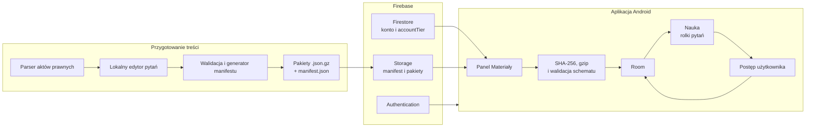
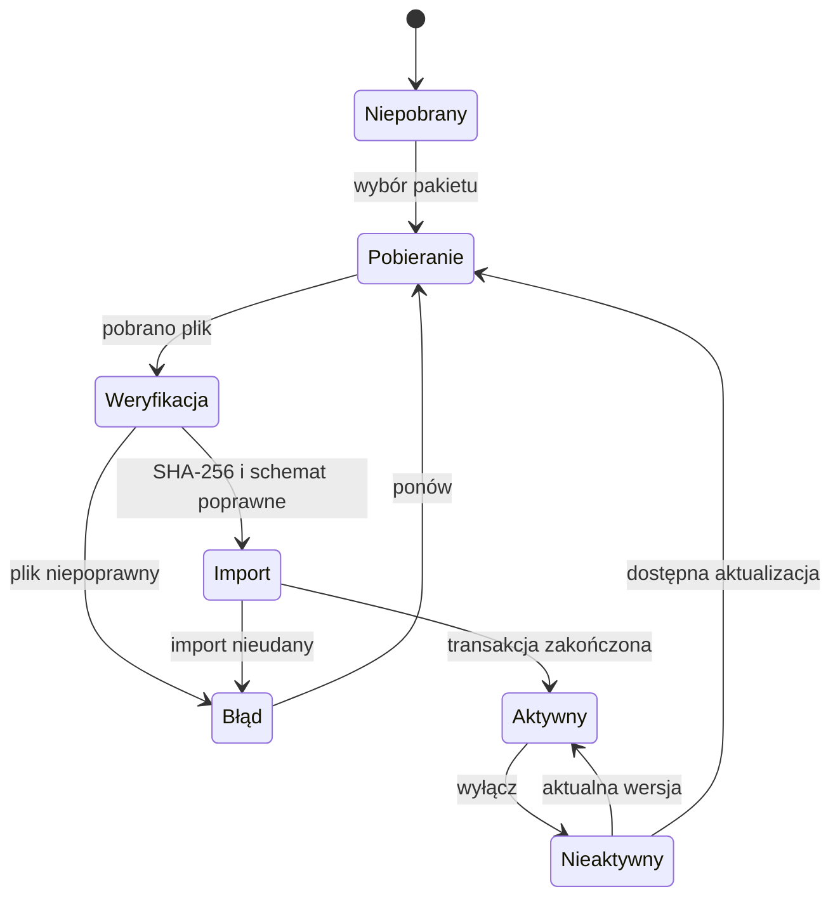
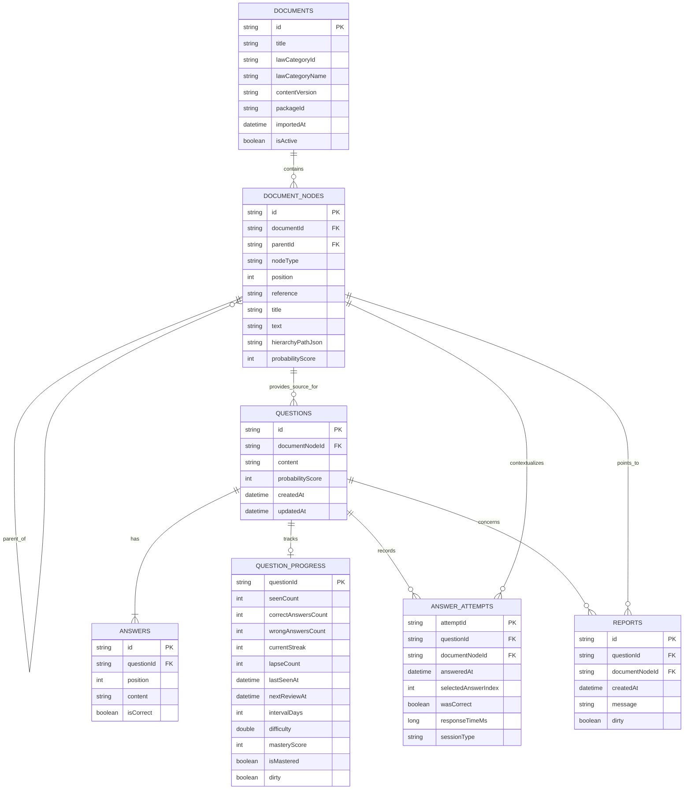

# APPlikacja

> Mobilna aplikacja do nauki prawa poprzez krótkie, interaktywne pytania testowe.

APPlikacja pomaga przygotowywać się do prawniczych egzaminów testowych. Łączy
mechanikę pionowo przewijanych „rolek” z wiarygodnym źródłem prawnym, nauką
offline oraz wersjonowanymi pakietami pytań pobieranymi na żądanie.

Projekt powstał jako natywna aplikacja Android w Kotlinie i Jetpack Compose.
Kod źródłowy pozostaje w prywatnym repozytorium — tutaj prezentuję działający
produkt, jego architekturę oraz najważniejsze decyzje techniczne.

## Demo

<!--
Przed publikacją:
1. Dodaj nagranie jako media/applikacja-demo.mp4.
2. Dodaj pionowy kadr z nagrania jako media/demo-cover.png.
3. Najlepszą zgodność przeglądarek zapewni MP4 zakodowany jako H.264.
-->

**[▶ Odtwórz pełne demo](media/applikacja-demo.mp4)**

W demonstracji pokazuję logowanie, pobranie materiałów, naukę w formie rolek,
sprawdzenie odpowiedzi oraz gest przełączający pytanie na treść właściwego
przepisu.

## Najważniejsze możliwości

- logowanie przez e-mail i Google z wykorzystaniem Firebase Authentication,
- katalog materiałów pobierany dynamicznie z Firebase Storage,
- pobieranie wybranych, wersjonowanych pakietów pytań `.json.gz`,
- kontrola integralności paczki przez rozmiar pliku i sumę SHA-256,
- rozpakowanie, walidacja i transakcyjny import poza głównym wątkiem,
- lokalna baza Room umożliwiająca naukę bez połączenia z internetem,
- pionowy feed pytań oparty na `VerticalPager`,
- gest poziomy przełączający kartę pytania i kartę źródła prawnego,
- zapis odpowiedzi i indywidualnego postępu nauki,
- aktywowanie i wyłączanie materiałów bez ponownego pobierania,
- automatyczna aktualizacja aktywnych pakietów,
- jasny i ciemny motyw Material 3,
- podstawowe wsparcie dostępności, w tym akcje TalkBack.

## Jak działa aplikacja

1. Po zalogowaniu aplikacja pobiera mały `manifest.json` opisujący dostępne
   dziedziny, wersje i lokalizacje pakietów.
2. Użytkownik wybiera materiały, które chce zachować na urządzeniu.
3. Aplikacja pobiera skompresowany pakiet do pliku tymczasowego i sprawdza jego
   sumę SHA-256.
4. Rozpakowanie, walidacja i import do Room odbywają się na `Dispatchers.IO`,
   dzięki czemu interfejs pozostaje responsywny.
5. Ekran Nauka losuje pytania wyłącznie z aktywnych pakietów zapisanych lokalnie.

## Interfejs

<!--
Zastąp poniższe pliki własnymi zrzutami ekranu. Najlepiej użyć obrazów o tej
samej wysokości i przyciąć je do samego ekranu telefonu.
-->

| Nauka | Materiały | Źródło pytania |
| :---: | :---: | :---: |
|  |  |  |

### Nauka w formie rolek

Każde pytanie zajmuje jedną pionową stronę. Po udzieleniu odpowiedzi aplikacja
natychmiast wskazuje wynik. Przesunięcie karty w prawo odsłania pełną treść
przepisu, z którego pochodzi pytanie, a przesunięcie w lewo wraca do testu.
Pozwala to sprawdzić podstawę prawną bez opuszczania bieżącej rolki.

### Materiały dostępne offline

Panel Materiały pokazuje pakiety opublikowane w zdalnym manifeście oraz ich
aktualny stan: niepobrany, pobierany, instalowany, aktywny, nieaktywny albo
wymagający aktualizacji. Wyłączenie materiału zwalnia miejsce w limicie konta,
ale zachowuje dane na urządzeniu.

## Architektura

Aplikacja wykorzystuje podejście offline-first. Firebase nie służy do
pobierania każdego pytania osobno — backend dystrybuuje wersjonowane paczki,
a właściwa nauka działa na lokalnych danych.

| Obszar | Rozwiązanie |
| --- | --- |
| Interfejs | Jetpack Compose, Material 3, Navigation Compose |
| Stan UI | ViewModel, StateFlow |
| Operacje asynchroniczne | Kotlin Coroutines, `Dispatchers.IO` |
| Lokalna baza | Room |
| Uwierzytelnianie | Firebase Authentication, Google Sign-In |
| Dane konta | Cloud Firestore |
| Dystrybucja treści | Firebase Storage, JSON, gzip, SHA-256 |
| Budowanie | Gradle Kotlin DSL |
| Testy | JUnit, testy parserów i polityk, Compose UI tests |

### Przepływ stanu materiału

## Lokalny model danych

Room przechowuje zarówno wersjonowaną treść prawną, jak i lokalny postęp
użytkownika. Pakiet jest importowany jako jeden dokument, dlatego aktualizacja
nie usuwa pozostałych dziedzin ani historii odpowiedzi.

## Najciekawsze decyzje techniczne

### Paczki zamiast wielu odczytów

Treść pytań nie jest pobierana z Firestore rekord po rekordzie. Mały manifest
opisuje dostępne materiały, a Firebase Storage dostarcza skompresowane pakiety.
Ogranicza to liczbę operacji sieciowych, ułatwia kontrolę kosztów i pozwala
korzystać z aplikacji offline.

### Bezpieczna aktualizacja treści

Nowa wersja trafia najpierw do pliku tymczasowego. Dopiero po sprawdzeniu
rozmiaru, SHA-256, gzip i schematu jest zapisywana transakcyjnie. Poprzednia
wersja pozostaje użyteczna, jeśli pobranie lub walidacja się nie powiedzie.

### Stabilne identyfikatory

Dokumenty, przepisy, pytania i odpowiedzi używają stabilnych identyfikatorów
tekstowych. Aktualizacja pakietu może dzięki temu zachować postęp przypisany do
pytań, które nie zmieniły swojej tożsamości.

### Płynny interfejs

Transfer, dekompresja, parsowanie i import wykonywane są poza głównym wątkiem.
Stan operacji jest obserwowany przez Compose, dlatego użytkownik może zmienić
zakładkę, gdy materiały nadal są przygotowywane.

## Jakość

Projekt zawiera testy obejmujące m.in.:

- parser i walidację manifestu,
- parser pakietów treści,
- limit aktywnych materiałów dla typów kont,
- harmonogram powtórek,
- nawigację głównych zakładek,
- gest przełączania pytania i źródła,
- stany oraz odświeżanie panelu Materiały,
- generator manifestu publikacyjnego.

Przed zatwierdzaniem zmian uruchamiane są testy jednostkowe, kompilacja aplikacji
i testów instrumentacyjnych oraz Android Lint.

## Status projektu

APPlikacja jest rozwijanym MVP. Aktualny przepływ obejmuje:

- rejestrację i logowanie,
- pobieranie oraz zarządzanie materiałami,
- lokalny import i naukę offline,
- rolki pytań wraz ze źródłami,
- zapisywanie postępu na urządzeniu.

W kolejnych etapach planowane są synchronizacja postępu między urządzeniami,
pełny tryb egzaminacyjny, statystyki oraz bezpieczny proces obsługi kont Premium.

## O projekcie

APPlikację zaprojektowałem i rozwijam samodzielnie — od modelu produktu i
interfejsu, przez aplikację Android oraz lokalną bazę, po pipeline przygotowania
i dystrybucji treści.

Repozytorium jest prezentacją projektu i nie zawiera jego kodu źródłowego.
Chętnie opowiem o implementacji, kompromisach architektonicznych i dalszym
kierunku rozwoju podczas rozmowy technicznej.

<!--
Opcjonalnie dodaj:

## Kontakt

- LinkedIn: https://www.linkedin.com/in/TWOJ-PROFIL
- GitHub: https://github.com/TWOJ-LOGIN
- E-mail: twoj@email.pl
-->

---

> APPlikacja jest narzędziem edukacyjnym i nie stanowi źródła porad prawnych.
